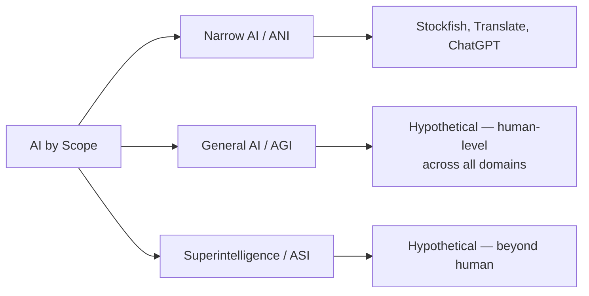
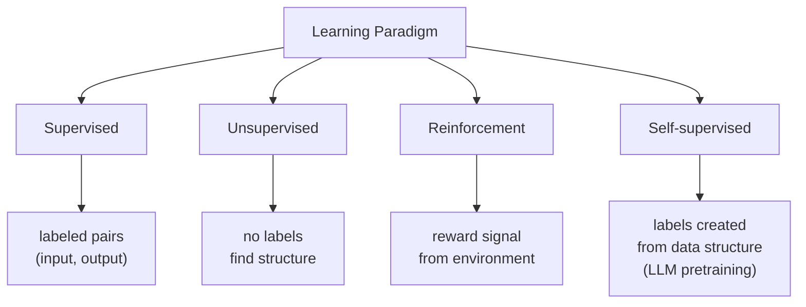

<section data-depth="surface">

## พูดสั้นๆ

"AI" ไม่ใช่สิ่งเดียว — เป็นกลุ่มของเทคโนโลยีหลายแบบที่จำแนกได้หลายแกน. แกนสำคัญคือ (1) **ขอบเขตของความสามารถ** (narrow / general / super), (2) **วิธีการ** (symbolic / statistical / hybrid), (3) **ประเภทของ output** (discriminative / generative), และ (4) **paradigm การเรียน** (supervised / unsupervised / reinforcement / self-supervised). ระบบจริงมักเป็นการผสมหลายแกนพร้อมกัน — เช่น ChatGPT คือ narrow + statistical + generative + self-supervised pretraining + RLHF.

เวลาเราพูดถึง "AI" ในชีวิตประจำวัน เรามักหมายถึงคนละสิ่งกัน. AI ที่อยู่ในเครื่องคิดเลขของ Google Photos ที่ตรวจหาหน้าคน, AI ที่อยู่หลัง Siri, AI ที่ชนะ Go ของ DeepMind, และ ChatGPT — ทั้งหมดเรียก "AI" ทั้งสิ้น แต่กลไกข้างใน, ความสามารถ, และข้อจำกัด ต่างกันอย่างมาก.

การมี **taxonomy** (ระบบจำแนกประเภท) ช่วยให้เราเหตุผลกับ AI ได้แม่นขึ้น — ไม่ใช่แค่เรื่องเชิงวิชาการ แต่เพราะ AI แต่ละแบบมีจุดแข็ง จุดอ่อน และวิธีใช้ที่ต่างกัน. ถ้าเรารวมทั้งหมดไว้เป็น "AI" คำเดียว เราจะคุยกันไม่รู้เรื่อง — เช่น คำถาม "AI จะมาแทนที่มนุษย์ไหม" จะตอบไม่ได้ เพราะคำว่า "AI" ในคำถามไม่ชัด.

ในบทนี้เราจะมอง AI ผ่าน 4 แกนหลัก:

1. **ขอบเขต (Scope):** ทำเรื่องเดียว vs ทำได้ทุกเรื่องแบบมนุษย์ vs เหนือมนุษย์
2. **วิธีการ (Approach):** เขียน rule ด้วยมือ vs เรียนจาก data vs ผสม
3. **Output:** จำแนกประเภท (discriminative) vs สร้างของใหม่ (generative)
4. **วิธีเรียน (Learning paradigm):** มีตัวอย่างกับเฉลย vs ไม่มีเฉลย vs เรียนจาก reward vs สร้างเฉลยให้ตัวเอง

ระบบจริงมักเป็น **จุดตัดของหลายแกน** — เช่น ChatGPT เป็น "Narrow + Statistical + Generative + Self-supervised pretraining". การคิดเป็นจุดตัดแบบนี้ช่วยให้เข้าใจระบบใหม่ ๆ ได้เร็วขึ้น.

### Mental model

นึกถึง AI taxonomy เป็น **ระบบพิกัด** ไม่ใช่ **ตู้แบ่งช่อง**. AI system หนึ่งไม่ได้อยู่ใน "ช่อง" เดียว — มันมีพิกัดบนหลายแกนพร้อมกัน. ChatGPT มีพิกัดบนแกน "ขอบเขต" ที่ narrow, บนแกน "วิธีการ" ที่ statistical, บนแกน "output" ที่ generative และอื่น ๆ.

**ผลตามมา 3 ข้อ:**
1. ระบบ AI สองตัวที่ดูคล้ายกันจาก outside (เช่น ทั้งคู่ใช้ neural network) อาจมีพิกัดต่างกันบนแกนสำคัญและพฤติกรรมต่างกันมาก
2. การถามว่า "นี่คือ AI ประเภทอะไร" คำตอบที่ดีต้องระบุพิกัดบนหลายแกน — ไม่ใช่คำเดียว
3. taxonomy นี้ **ไม่ใช่ความจริงสัมบูรณ์** — เป็นเครื่องมือ. ระบบจริงบางตัว blur boundary ระหว่างแกน (ดู section สุดท้าย)

---

</section>

<section data-depth="deeper">

## ลึกขึ้นหน่อย

### 2.1 By Capability Scope — ขอบเขตของความสามารถ

แกนนี้ถามว่า AI ทำอะไรได้บ้าง เทียบกับมนุษย์.

**Narrow AI (Artificial Narrow Intelligence, ANI)** — บางครั้งเรียก "Weak AI"
ออกแบบมาทำงานเฉพาะอย่าง. มากกว่า 99% ของ AI ที่มีอยู่ปี 2026 อยู่ในกลุ่มนี้.
- ตัวอย่าง: Stockfish (เล่นหมากรุก), Google Translate (แปลภาษา), image classifier ที่ตรวจมะเร็งใน X-ray
- **LLM อย่าง GPT-4, Claude ก็เป็น Narrow AI** — แม้จะดูเหมือนทำได้หลายอย่าง แต่ทุก task ที่มันทำคือ **next-token prediction** เท่านั้น. ความหลากหลายเกิดจากการที่ next-token prediction ครอบคลุม task หลายแบบในระดับ output ไม่ใช่เพราะมีหลายระบบย่อย
- ข้อจำกัดสำคัญ: ไม่ generalize ออกไปนอก distribution ของสิ่งที่ training data ครอบคลุม

**General AI (Artificial General Intelligence, AGI)** — บางครั้งเรียก "Strong AI"
สมมุติฐาน: AI ที่ทำงานทาง cognitive ได้ในระดับมนุษย์ **ในทุกโดเมน**. ยังไม่มีจริงในปี 2026.
- คุณสมบัติที่คนคาดหวัง: เรียนรู้งานใหม่จากตัวอย่างน้อย ๆ, transfer ความรู้ข้ามโดเมน, มี common sense, วางแผนระยะยาว, มี meta-cognition
- มีถกเถียงในวงการว่า LLM ปัจจุบันเป็น "ก้าวสู่ AGI" หรือเป็น "ทางตัน" — ยังไม่มีฉันทามติ ดู  ที่ตั้งคำถามว่า foundation model อยู่ตรงไหนใน spectrum นี้
- คำว่า "AGI" เองยังนิยามไม่ลงตัว — บางคนนิยามด้วย task บางคนนิยามด้วย capability บางคนนิยามด้วยผลทางเศรษฐกิจ

**Superintelligence (Artificial Superintelligence, ASI)**
สมมุติฐาน: AI ที่เหนือมนุษย์ในทุกโดเมน. เป็นเรื่อง speculative — อยู่ในขอบเขตของ AI safety และปรัชญา.
- ดู [ai-safety-overview](/advanced/ai-safety-overview) สำหรับ implication ทางความปลอดภัย
- สำหรับ Level 1 รู้แค่ว่า ASI เป็น hypothetical และเป็นแรงผลักของงานวิจัย alignment

### 2.2 By Approach — วิธีการสร้าง intelligence

แกนนี้ถามว่า AI ได้ "ความฉลาด" มาจากไหน.

**Symbolic AI** (บางครั้งเรียก GOFAI — "Good Old-Fashioned AI")
มนุษย์เขียน rule, logic, และ knowledge representation ลงไปในระบบโดยตรง.
- ตัวอย่าง: expert system สำหรับวินิจฉัยโรค (MYCIN), planner ใน robotics แบบเก่า, theorem prover, rule-based chatbot ยุคแรก
- จุดแข็ง: อธิบายได้ (interpretable), reasoning step ชัดเจน, ตรวจสอบความถูกต้องได้
- จุดอ่อน: brittle — เจอ input ที่ไม่ได้คาดไว้แล้วล้ม, scale ไม่ได้กับ knowledge ที่ซับซ้อนเชิงผิวเผิน (เช่น perception, ภาษาธรรมชาติ)
- ครองวงการ AI ตั้งแต่ 1950s ถึง ~1990s ดูบริบทใน [history-of-ai](/foundations/history-of-ai)

**Statistical / Machine Learning AI**
ระบบ **เรียน pattern จาก data** แทนที่จะถูกเขียน rule ตรง ๆ.
- ตัวอย่าง: spam classifier, recommendation system, image recognition, LLM ทุกตัว
- จุดแข็ง: scale กับ data ได้, จัดการ input ที่หลากหลายและ noisy ได้, ทำงาน perception ได้ดีกว่า symbolic มาก
- จุดอ่อน: อธิบายได้ยาก (โดยเฉพาะ deep learning), ต้องการ data จำนวนมาก, อาจเรียน bias จาก data, generalize นอก distribution ไม่ดี
- ครองวงการ AI ตั้งแต่ ~2010 เป็นต้นมา (เร่งโดย deep learning ตั้งแต่ AlexNet 2012)

**Hybrid / Neuro-symbolic AI**
ผสมสองแบบเข้าด้วยกัน — ใช้ neural network สำหรับ perception/intuition และ symbolic component สำหรับ logical reasoning.
- ตัวอย่าง: AlphaGeometry (DeepMind 2024) ผสม LLM กับ symbolic theorem prover, retrieval-augmented generation (RAG) แบบกว้าง ๆ ก็ถือเป็น hybrid (LLM + symbolic retrieval)
- เป็นพื้นที่วิจัยที่ active — มีสมมติฐานว่าทางขึ้น AGI อาจต้องผ่าน hybrid ไม่ใช่ pure neural

ดู Russell & Norvig  เพื่อภาพรวมประวัติศาสตร์ของทั้งสาม approach.

### 2.3 By Output Type — Discriminative vs Generative

แกนนี้ถามว่า model **ผลิตอะไร**.

**Discriminative models** — เรียน "เส้นแบ่ง" ระหว่างประเภท
- เป้าหมาย: ได้ input → ทำนาย label หรือค่า. เรียน $P(y \mid x)$ (probability ของ label เมื่อมี input)
- ตัวอย่าง: spam vs not-spam classifier, dog vs cat image classifier, sentiment analysis, ตัวทำนายราคาบ้าน
- intuition: model "วาดเส้นแบ่ง" ในพื้นที่ของ input — input ใหม่ตกข้างไหน ก็เป็นประเภทนั้น
- จุดแข็ง: efficient สำหรับงาน classification, ต้องการ data น้อยกว่า generative ที่จะได้ accuracy ดี

**Generative models** — เรียน "การกระจาย" ของ data
- เป้าหมาย: เรียน distribution ของ data $P(x)$ หรือ $P(x \mid y)$ — สามารถ **สร้างตัวอย่างใหม่** ที่ดูเหมือนมาจาก distribution นั้น
- ตัวอย่าง: LLM (สร้าง text), Stable Diffusion / DALL-E (สร้างภาพ), audio generation, GAN
- intuition: model เรียน "หน้าตา" ของ data ทั้งหมด แล้ว sample ออกมาเป็นตัวอย่างใหม่ที่หน้าตาคล้าย training data
- จุดแข็ง: ทำงานที่ open-ended ได้ (เขียน, วาด, แต่ง), อาจเรียน representation ที่ดีกว่า discriminative ในบาง task
- จุดอ่อน: training ยากกว่า, evaluate ยากกว่า (เพราะไม่มี ground truth ที่ชัด), อาจ **hallucinate** (ดู [hallucination](/using-ai/hallucination))

ดู Goodfellow et al.  บทที่ 20 สำหรับการเปรียบเทียบเชิง formal.

**สำคัญ:** model ตัวเดียวกันบางครั้งทำได้ทั้งสองแบบ. LLM เป็น generative model แต่ใช้ทำ classification ก็ได้ (เช่น ถามว่า "email นี้เป็น spam หรือไม่" คือใช้ generative model มาทำงาน discriminative).

### 2.4 By Learning Paradigm — วิธีการเรียน

แกนนี้ถามว่า model เรียนจาก **signal แบบไหน**. รายละเอียดเต็มอยู่ใน [what-is-machine-learning](/foundations/what-is-machine-learning) — ที่นี่เป็น preview.

**Supervised learning** — เรียนจาก labeled examples
- มี (input, correct output) เป็นคู่ ๆ — model เรียนจาก mapping
- ตัวอย่าง: ภาพหมา → label "หมา", email → label "spam/not-spam", ภาษาอังกฤษ → ภาษาไทย (machine translation แบบ supervised)
- ใช้กว้างที่สุดในงาน production

**Unsupervised learning** — เรียน structure จาก unlabeled data
- ไม่มี label — model หา pattern เอง เช่น cluster, dimensionality reduction
- ตัวอย่าง: K-means clustering (จัดกลุ่มลูกค้า), PCA, topic modeling
- ใช้ในงาน exploratory analysis, anomaly detection

**Reinforcement learning (RL)** — เรียนจาก reward signal ผ่านการ interaction
- agent ทำ action → environment ให้ reward → agent ปรับ policy ให้ reward สะสมสูงขึ้น
- ตัวอย่าง: AlphaGo (เล่น Go), robotics, game playing, RLHF ที่ใช้ฝึก ChatGPT/Claude (ดู [rlhf-and-rlaif](/advanced/rlhf-and-rlaif))
- ต่างจาก supervised ตรงที่ไม่มี "เฉลยที่ถูก" — มีแค่ "ผลตอบแทน"

**Self-supervised learning** — สร้าง label จาก structure ของ data เอง
- ไม่มีคนติด label แต่ model **สร้าง prediction task ขึ้นมาเอง** จาก data เปล่า ๆ
- ตัวอย่างที่สำคัญที่สุด: **next-token prediction ใน LLM** — input คือ text บางส่วน, label คือ token ถัดไปใน text เดิม. ไม่ต้องมีคนติด label — data เปล่าทำหน้าที่ทั้งคู่
- เป็นเหตุผลที่ LLM scale ได้ — สามารถใช้ text ทั้ง internet เป็น training data โดยไม่ต้องจ้าง annotator
- เทคนิคนี้ปลดล็อก foundation model ยุคปัจจุบัน 

### 2.5 Putting It Together — ตัวอย่างจัดประเภท ChatGPT

ChatGPT เป็นจุดตัดของหลายแกน:

| แกน | พิกัด |
|---|---|
| Scope | **Narrow AI** — ทำ next-token prediction เป็นหลัก แม้จะดูเหมือนทำได้หลายอย่าง |
| Approach | **Statistical/ML** — เรียนจาก data ทั้งหมด ไม่มี hand-coded rule |
| Output | **Generative** — สร้าง text ใหม่ ไม่ใช่แค่ classify |
| Learning (stage 1) | **Self-supervised pretraining** — next-token prediction บน text ขนาด trillion-token |
| Learning (stage 2) | **Supervised fine-tuning (SFT)** — เรียนจาก (instruction, response) ที่มนุษย์เขียน |
| Learning (stage 3) | **Reinforcement learning (RLHF)** — ปรับให้ตรงกับ human preference |

นี่คือเหตุผลที่ taxonomy หลายมิติมีประโยชน์ — ระบบเดียว ChatGPT แตะ 4 paradigm การเรียน, ใช้ approach statistical ล้วน, output แบบ generative, อยู่ในกลุ่ม narrow. ถ้าเรามอง ChatGPT แค่ว่า "generative AI" หรือ "LLM" จะพลาด structure ภายในนี้.

ลองอีกตัวอย่าง — **AlphaGo:**
- Scope: Narrow (เล่น Go), Approach: Statistical (deep neural network), Output: Discriminative (เลือก move ที่ดีที่สุด, ไม่ได้ generate game), Learning: Supervised (จากเกมมนุษย์) + Reinforcement (self-play)

และ **Google Translate ยุคก่อน 2016:**
- Scope: Narrow, Approach: Statistical (statistical machine translation, ไม่ใช่ neural), Output: Generative (สร้าง text แปล), Learning: Supervised (parallel corpus)

### 2.6 Taxonomy เป็นเครื่องมือ ไม่ใช่กฎ

ระบบจริง blur boundary บ่อยมาก:
- **Discriminative vs generative** ของ LLM — LLM เป็น generative แต่ใช้ทำงาน classification ก็ได้
- **Narrow vs general** — LLM ตัวใหญ่ทำงานหลายชนิดได้ดีเกินคาด คนถกเถียงว่า "ยังถือเป็น narrow อยู่ไหม"
- **Symbolic vs statistical** — modern agentic system ผสม LLM (statistical) กับ tool/code execution (symbolic) — เป็น hybrid โดยปริยาย
- **Self-supervised vs unsupervised** — บางตำราจัด self-supervised ภายใต้ unsupervised; บางตำราแยก. ทั้งสองมุมมองมีเหตุผล

จุดประสงค์ของ taxonomy คือ **ช่วยให้เหตุผลกับระบบใหม่ ๆ ได้เร็ว** ไม่ใช่บังคับให้ทุกระบบเข้าช่อง. เวลาเจอ AI system ใหม่ ลองถาม 4 คำถามนี้ — Scope? Approach? Output type? Learning paradigm? — แล้วจะได้ภาพที่หลายมิติแทนคำอธิบายแบนเดียว.

---

## Worked Examples

### Example 1: จัดประเภท Stable Diffusion
**ระบบ:** Stable Diffusion (text-to-image generator)
- **Scope:** Narrow AI — ทำ image generation จาก text เป็นหลัก
- **Approach:** Statistical — deep neural network (diffusion model), ไม่มี hand-coded rule
- **Output:** Generative — สร้างภาพใหม่
- **Learning paradigm:** Self-supervised pretraining (เรียนจาก (image, caption) คู่ ๆ ที่ scrape มาจาก internet — เป็น self-supervised เพราะ caption-image pair ใช้แทน label)

จุดสังเกต: แม้ Stable Diffusion กับ ChatGPT จะอยู่ใน "generative AI" เหมือนกัน แต่ architecture (diffusion vs autoregressive transformer) ต่างกันมาก.

### Example 2: จัดประเภท Spam Filter ของ Gmail
**ระบบ:** Gmail spam classifier
- **Scope:** Narrow AI — ตัดสิน spam vs not-spam
- **Approach:** Statistical (modern) — เป็น neural network ที่เรียนจาก label จากผู้ใช้กดปุ่ม "Report spam"
- **Output:** Discriminative — ทำนาย label เท่านั้น
- **Learning paradigm:** Supervised — มี (email, label) คู่กันชัดเจน

ในยุคก่อน 2010 spam filter เคยเป็น symbolic AI (rule-based, regex match) — เปลี่ยนมาเป็น statistical เพราะ spammer ปรับ pattern เร็วเกินกว่าจะเขียน rule ตามทัน.

### Example 3: ตอบคำถาม "AI จะแทนที่งานมนุษย์ไหม"
คำถามนี้ตอบไม่ได้ถ้าไม่ระบุ "AI ประเภทไหน":
- Narrow AI **กำลังแทนที่งานบางส่วน** อยู่แล้ว — เช่น email triage, image tagging, basic translation, first-draft writing
- AGI **ยังไม่มี** — การถามว่าจะ "แทนที่" เร็วแค่ไหน เท่ากับถามว่า AGI จะมาเมื่อไหร่ ซึ่งเป็นคำถามเปิดที่มีฉันทามติต่ำมาก
- ASI **เป็น speculative** — ถ้าเกิด implication กว้างกว่าแค่ "แทนที่งาน" มาก

นี่คือเหตุผลที่ taxonomy สำคัญ — ทำให้แยกคำถามที่ตอบได้วันนี้ ออกจากคำถามที่ยังไม่มีคำตอบ.

---

## Common Misconceptions

1. **ความเข้าใจผิด:** ChatGPT เป็น General AI (AGI) แล้ว เพราะมันคุยได้ทุกเรื่อง
   **ความจริง:** ChatGPT เป็น **Narrow AI** ที่ทำงานเดียวคือ next-token prediction. ที่ดูเหมือน "ทำได้ทุกเรื่อง" เพราะ next-token prediction ครอบคลุม output หลายรูปแบบ ไม่ใช่เพราะมีหลายระบบย่อยภายใน. AGI ต้องการ generalization, transfer, common sense, และ planning ในระดับที่ LLM ปัจจุบันยังทำได้ไม่ดี

2. **ความเข้าใจผิด:** Generative AI = AI ที่สร้าง content เท่านั้น discriminative AI ตายแล้ว
   **ความจริง:** Discriminative model ยังเป็นกระดูกสันหลังของ production AI ส่วนใหญ่ — fraud detection, recommendation, search ranking, medical imaging classifier ฯลฯ. Generative AI ได้ความสนใจมากเพราะ LLM แต่งานจำแนกประเภทยังเป็นงาน mainstream

3. **ความเข้าใจผิด:** Symbolic AI ตายแล้ว แทนที่ด้วย deep learning ทั้งหมด
   **ความจริง:** Symbolic component ยังอยู่ในระบบ AI สมัยใหม่ — RAG ใช้ retrieval แบบ symbolic, agent ใช้ tool/code execution แบบ symbolic, formal verifier ยังเป็น symbolic ล้วน. Trend จริงคือ **hybrid** — neural สำหรับ perception, symbolic สำหรับ reasoning ที่ต้องเชื่อถือได้

4. **ความเข้าใจผิด:** Self-supervised learning เป็นแค่ unsupervised แบบเปลี่ยนชื่อ
   **ความจริง:** ต่างกันที่ **มี label หรือไม่ในการ training**. Unsupervised ไม่มี label เลย — เรียน structure ของ data (เช่น cluster). Self-supervised **มี label** แต่ label ถูก derive จาก data เอง (เช่น token ถัดไปเป็น label ของ token ก่อนหน้า). การมี label ทำให้ใช้ machinery ของ supervised learning ได้ — นี่คือเหตุผลที่ LLM pretraining ทำงานได้ดี

5. **ความเข้าใจผิด:** AI หนึ่งระบบเลือกได้ paradigm เดียว
   **ความจริง:** ระบบใหญ่ ๆ ใช้หลาย paradigm พร้อมกัน — ChatGPT ใช้ self-supervised pretraining, supervised fine-tuning, **และ** reinforcement learning ใน pipeline เดียว. แต่ละ stage แก้ปัญหาคนละด้าน

---

## Self-Check

ลองตอบให้ได้โดยไม่ดูข้างบน:

1. **(Recall)** ANI, AGI, ASI ย่อมาจากอะไร และต่างกันยังไง?
2. **(Recall)** Discriminative และ Generative model ต่างกันที่จุดไหนเชิง intuition?
3. **(Explain)** ทำไม LLM อย่าง ChatGPT ถึงยังถือว่าเป็น Narrow AI แม้จะดูเหมือนทำได้ทุกเรื่อง?
4. **(Apply)** ลองจัดประเภท Google Photos face recognition ตาม 4 แกน (Scope, Approach, Output, Learning paradigm)
5. **(Apply)** ถ้าจะสร้างระบบ "ตรวจหา fraud transaction ใน online banking" — ควรเป็น discriminative หรือ generative? supervised หรือ unsupervised? เพราะอะไร?
6. **(Synthesize)** ทำไม Self-supervised learning ถึงเป็น "ตัวปลดล็อก" ของยุค LLM — ถ้าไม่มี paradigm นี้ ปัจจุบันจะเป็นยังไง?

---

</section>
